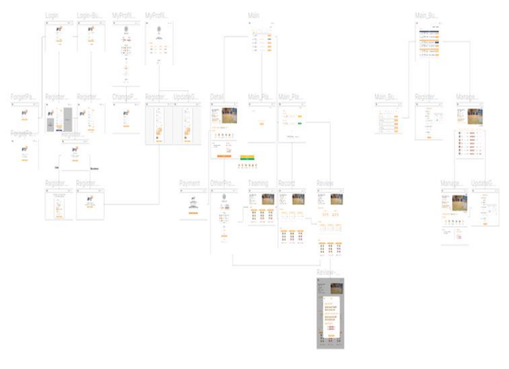

# BITZ - Basketball In The Zone

> 농구에 미쳐라! - 농구 픽업 게임 예약/매칭 애플리케이션
>
> 개발 기간: 2021.07.05. ~ 2021.08.20.

## 목차

[0. 팀소개](#0-팀소개)

[1. 서비스 소개](#1-서비스-소개)

[2. 기술스택](#2-기술스택)

[3. 와이어프레임 및 ERD](#5-사이트-레이아웃-및-디자인)

[4. 시연 영상](https://www.youtube.com/watch?v=xx9qydfb-xw&feature=youtu.be) (54초 부터 시연 시작)

## 0. 팀소개
|권오우|박정웅|윤지영|이소은|장현웅|
| ------ | ------ | ------ | ------ | ------ |
| FrontEnd | FrontEnd | BackEnd | BackEnd | FrontEnd + BackEnd |
|  |  |  |  |  |

  

## 1. 서비스 소개

> 기존 예약 시스템의 불편함을 개선한 농구 픽업 게임 플랫폼

#### 1.1 기획 배경

기존 픽업 게임 예약 방식은 아래와 같다.

1. 실내 농구장을 보유한 개인(체육관 소유자)가 체육관의 빈 시간에 픽업 게임을 계획
2. 체육관 소유자가 cafe, 카카오톡, 네이버 밴드 등에 픽업 게임 참가자 모집 글 등록
3. 글 확인 후 픽업 게임 참여 희망자들이 체육관 소유자에게 개별 연락
4. 체육관 소유자가 문자를 확인 후 입금 요청
5. 참가자들은 입금 후 다시 개별 연락
6. 체육관 소유자가 입금을 확인한 후 참가자에게 참가 확정 문자 전송

기존 예약 시스템은 자동화가 되어 있지 않아 예약까지 시간이 오래 소요되고 번거롭다는 문제점이 있다.

#### 1.2 목적

농구 픽업 게임을 즐기는 사람들이 날짜별, 시간별로 픽업 게임 리스트를 한 눈에 확인할 수 있고 한 번의 클릭으로 예약을 확정 지을 수 있도록 하여 간단하게 픽업 게임을 즐길 수 있도록 한다. 체육관 소유자도 픽업 게임 인원이 충족되면 자동으로 게임을 확정지을 수 있도록 한다. 이로써 체육관 소유자와 참가자 모두 픽업 게임에만 집중할 수 있는 시스템을 만드는 것이 목적이다.

#### 1.3 BITZ 시연 영상

[시연 영상](https://www.youtube.com/watch?v=xx9qydfb-xw&feature=youtu.be) (54초 부터 시연 시작)

## 2. 기술스택

### 2.1 백엔드

- Spring Boot
- My SQL
- AWS S3

### 2.2 프론트엔드

- React.js

### 2.3 배포

- AWS EC2

### 2.5 협업 Tool

- Git
- Notion
- Jira

## 3. 와이어프레임 및 ERD

- 와이어 프레임

- ERD

- [개발문서](https://github.com/ohwoo-kwon/BITZ/blob/develop/exec/OSDS_BITZ_%EA%B0%9C%EB%B0%9C%EB%AC%B8%EC%84%9C_SUB23.pdf)

- [발표자료](https://github.com/ohwoo-kwon/BITZ/blob/develop/exec/OSDS_BITZ_%EC%B5%9C%EC%A2%85%EB%B0%9C%ED%91%9C.pdf)

## 4. [시연 영상](https://www.youtube.com/watch?v=xx9qydfb-xw&feature=youtu.be) (54초 부터 시연 시작)

상단의 링크를 클릭하여 BITZ의 시연 영상을 보실 수 있습니다!! 감사합니다😊
